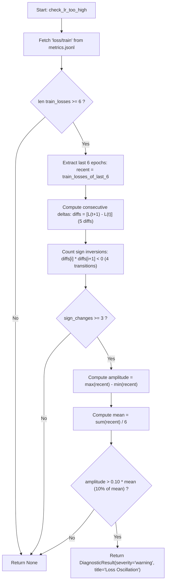

# xscope Diagnostics Deep Dive

This document provides a systematic, mathematical, and algorithmic breakdown of each diagnostic rule in `xscope` ([xscope/diagnostics.py](file:///Users/crimson/Activity/xscope/xscope/diagnostics.py)).

---

## 1. `check_lr_too_high` (Loss Oscillation / High Learning Rate)

### Overview
- **Rule Identifier:** `lr_too_high`
- **Decorator:** `@diagnostic_rule(name="lr_too_high", description="Checks for loss oscillation indicating high LR")`
- **Target Metric:** `loss/train` from `metrics.jsonl`
- **Output Severity:** `warning`
- **Primary Diagnostic Title:** `Loss Oscillation`

---

### Purpose & Theoretical Background
When the learning rate ($\eta$) in gradient descent is set too high relative to the local curvature (Hessian eigenvalues) of the loss surface, updates "overshoot" the minimum and bounce back and forth across the valley walls. 

Instead of monotonic or smooth decrease, the loss trajectory exhibits high-frequency oscillations (alternating between increasing and decreasing in consecutive steps/epochs).

```
Loss
 ^
 |    /\    /\
 |   /  \  /  \    <--- Severe oscillation (Overshooting valley)
 |  /    \/    \
 +-------------------> Epoch
```

The diagnostic rule identifies this specific signature by measuring:
1. **Directional Inversions (Sign changes in step-to-step deltas)**
2. **Relative Magnitude (Peak-to-trough amplitude relative to mean loss)**

---

### Step-by-Step Execution & Calculation Logic



#### Step 1: Data Ingestion & Minimum Length Check
```python
_, records = data_manager.get_records(run.get('run_path', ''), "metrics.jsonl")
train_losses = [r['loss/train'] for r in records if 'loss/train' in r]
if len(train_losses) < 6:
    return None
```
- Retrieves records via `RunDataManager.get_records()`.
- Extracts all available values where key `loss/train` is present.
- Requires **at least 6 training loss records** before attempting any calculation.

---

#### Step 2: Extract Rolling Window of Last 6 Epochs
```python
recent = train_losses[-6:]
```
- Let the last 6 loss values be represented as a vector:
  $$\mathbf{L} = [L_0, L_1, L_2, L_3, L_4, L_5]$$

---

#### Step 3: Compute First-Order Differences (Step Deltas)
```python
diffs = [recent[i+1] - recent[i] for i in range(len(recent)-1)]
```
- Computes the 5 discrete step-to-step differences:
  $$\Delta_i = L_{i+1} - L_i \quad \text{for } i \in \{0, 1, 2, 3, 4\}$$
- $\Delta_i > 0 \implies$ Loss increased from epoch $i$ to $i+1$.
- $\Delta_i < 0 \implies$ Loss decreased from epoch $i$ to $i+1$.

---

#### Step 4: Count Directional Inversions (Sign Changes)
```python
sign_changes = sum(1 for i in range(len(diffs)-1) if diffs[i] * diffs[i+1] < 0)
```
- Evaluates the 4 adjacent transition pairs:
  $$(\Delta_0, \Delta_1), \; (\Delta_1, \Delta_2), \; (\Delta_2, \Delta_3), \; (\Delta_3, \Delta_4)$$
- A sign change occurs if and only if:
  $$\Delta_i \cdot \Delta_{i+1} < 0$$
- If the loss increases then immediately decreases (or vice versa), the product is negative.
- **Trigger Threshold:** `sign_changes >= 3` out of a maximum possible 4.
  - In a 5-delta sequence, 3 or 4 sign changes represents extreme zig-zagging (e.g., $+ - + - +$, $- + - + -$, $+ - + - -$, etc.).

---

#### Step 5: Relative Amplitude Filter (Noise Gating)
```python
if sign_changes >= 3:
    amplitude = max(recent) - min(recent)
    if amplitude > 0.1 * (sum(recent) / len(recent)):
        ...
```
- **Peak-to-Trough Amplitude:**
  $$\text{Amplitude} = \max(\mathbf{L}) - \min(\mathbf{L})$$
- **Window Mean Loss:**
  $$\bar{L} = \frac{1}{6} \sum_{i=0}^5 L_i$$
- **Relative Threshold Condition:**
  $$\text{Amplitude} > 0.10 \times \bar{L}$$
- **Why this is needed:** Prevents false alarms on tiny floating-point fluctuations (e.g., loss oscillating between `0.50001` and `0.50002` where the relative amplitude is $<0.01\%$). The oscillation must span at least **10%** of the mean loss value.

---

### Diagnostic Output Details
When all conditions are met:
- **Severity:** `'warning'`
- **Title:** `'Loss Oscillation'`
- **Message:** `"Train loss oscillating with amplitude {amplitude:.4f} over last 6 epochs."`
- **Run Name:** Resolved via `_run_name(run)` (e.g. `"exp_demo #1"`).
- **Suggested Action:** `"Learning rate may be too high. Consider reducing by 10×."`

---

### Worked Numerical Example

#### Example 1: Oscillating High LR Run (Triggered)
- Given `recent = [1.20, 0.70, 1.15, 0.65, 1.10, 0.60]`
- Differences $\Delta$:
  - $\Delta_0 = 0.70 - 1.20 = -0.50$
  - $\Delta_1 = 1.15 - 0.70 = +0.45$
  - $\Delta_2 = 0.65 - 1.15 = -0.50$
  - $\Delta_3 = 1.10 - 0.65 = +0.45$
  - $\Delta_4 = 0.60 - 1.10 = -0.50$
- Products $\Delta_i \cdot \Delta_{i+1}$:
  - $\Delta_0 \cdot \Delta_1 = (-0.50)(+0.45) = -0.225 < 0$ (Sign change 1)
  - $\Delta_1 \cdot \Delta_2 = (+0.45)(-0.50) = -0.225 < 0$ (Sign change 2)
  - $\Delta_2 \cdot \Delta_3 = (-0.50)(+0.45) = -0.225 < 0$ (Sign change 3)
  - $\Delta_3 \cdot \Delta_4 = (+0.45)(-0.50) = -0.225 < 0$ (Sign change 4)
- Total sign changes = $4 \ge 3$ (Condition met).
- Amplitude $= 1.20 - 0.60 = 0.60$.
- Mean $\bar{L} = \frac{1.20 + 0.70 + 1.15 + 0.65 + 1.10 + 0.60}{6} = 0.90$.
- Threshold: $0.10 \times 0.90 = 0.09$.
- $0.60 > 0.09 \implies$ **Diagnostic Triggers Warning!**

#### Example 2: Normal Noisy Convergence (Not Triggered)
- Given `recent = [0.55, 0.53, 0.54, 0.52, 0.51, 0.50]`
- Differences $\Delta = [-0.02, +0.01, -0.02, -0.01, -0.01]$
- Sign changes = 2 ($< 3$).
- **Result:** Returns `None` (no false positive).

---

### Code Analysis & Potential Observations
1. **Window Size:** Fixed at the last 6 epochs ($N=6$). It assesses the current active training state.
2. **Metric Key Hardcoding:** Checks `loss/train`. If a framework logs `train/loss` or `train_loss`, standard mapping or key aliases would be needed.
3. **Flat Delta ($\Delta = 0$):** If two consecutive epochs have identical loss ($\Delta_i = 0$), the product is $0$ (not $<0$), which correctly avoids counting plateaued steps as oscillations.
4. **Negative / Near-Zero Losses:** If $\bar{L} \le 0$ (e.g. certain metric formulations or custom objectives that go negative), the amplitude threshold check `amplitude > 0.1 * mean` would evaluate differently; however, standard cross-entropy and regression losses are non-negative.

---

### In-Depth Investigation: `_, records = data_manager.get_records(run.get('run_path', ''), "metrics.jsonl")`

Let's address the question: **"Does `get_records` always give us the full records, and is this line completely safe?"**

#### 1. What `get_records` Actually Returns
`RunDataManager.get_records(run_path, filename)` returns a 2-tuple:
```python
tuple[bool, list[dict]]  # (has_changed, accumulated_records_list)
```
- The first element (`_` / `has_changed`) is a boolean indicating whether new bytes were read during **this specific invocation**.
- The second element (`records`) is the **complete list of all records** accumulated so far in memory (`state.records`).
- **Why discarding `_` is correct here:** Diagnostics rules need the entire historical window (all past epochs) to compute differences and trends, regardless of whether the file changed 1ms ago or 5 minutes ago. Even if `has_changed == False`, `records` still returns the full cached record list.

#### 2. Lifecycle & Internal State Machine in `RunDataManager`
When `get_records` runs, it executes one of the following branches:

| Scenario | Condition in `RunDataManager` | Behavior | Return Value |
| :--- | :--- | :--- | :--- |
| **File Missing** | `not os.path.isfile(filepath)` | Resets state if it previously existed; returns empty. | `(False, [])` or `(True, [])` |
| **File Unchanged (Cache Hit)** | `stat.st_size == state.size and stat.st_mtime == state.mtime` | Zero disk reads. Returns existing in-memory cache directly. | `(False, state.records)` |
| **File Appended (Incremental Read)** | `stat.st_size > state.size` | Seeks to `state.offset`, reads only new lines, parses JSON, appends to `state.records`, updates `offset`. | `(True, state.records)` |
| **File Rewritten / Truncated** | `stat.st_size <= state.size or stat.st_size < state.offset` | Detects file restart. Clears `state.records`, resets `state.offset = 0`, re-reads from start. | `(True, state.records)` |
| **Partial Line Written Mid-Flush** | `json.JSONDecodeError` on incomplete line | Breaks loop without advancing `state.offset` past incomplete line. Preserves valid records read so far and retries on next poll. | `(True, state.records)` |

#### 3. Potential Edge Cases & Gotchas to Be Aware Of

1. **Direct Mutation vs `state.records` Reference:**
   - `get_records` returns a reference to the internal `state.records` list stored inside `FileState`.
   - In `check_lr_too_high`, `train_losses = [r['loss/train'] for r in records ...]` uses a list comprehension (creating a new list), which is safe.
   - Any function that would call `records.pop()` or `records.clear()` directly would corrupt the central cache.
2. **Missing Key vs None/Non-Numeric Values:**
   - `train_losses = [r['loss/train'] for r in records if 'loss/train' in r]` checks for key presence, but not type.
   - If a record has `{"loss/train": None}` or a string, it passes `if 'loss/train' in r`, leading to a `TypeError` during subtraction. (Note: `check_loss_divergence` explicitly validates `isinstance(v, (int, float))`).
3. **Empty or Missing `run_path`:**
   - If `run` is missing `'run_path'`, `run.get('run_path', '')` defaults to `""`.
   - `os.path.join("", "metrics.jsonl")` evaluates to `"metrics.jsonl"` (relative to the current working directory). If a file named `metrics.jsonl` exists in the CWD, it would inadvertently read that.

